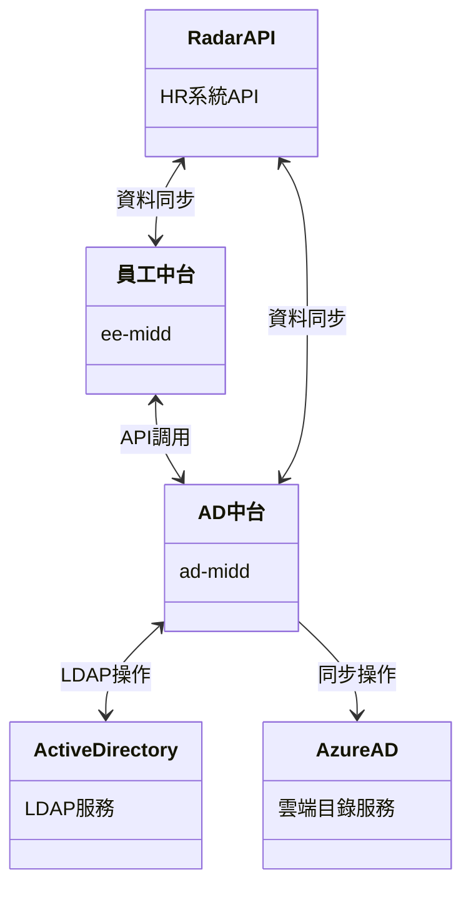
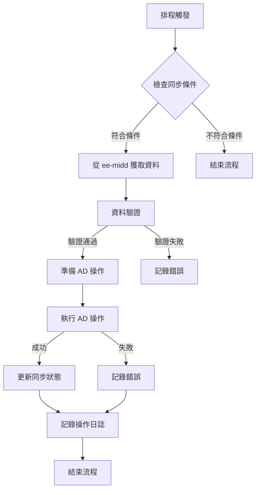
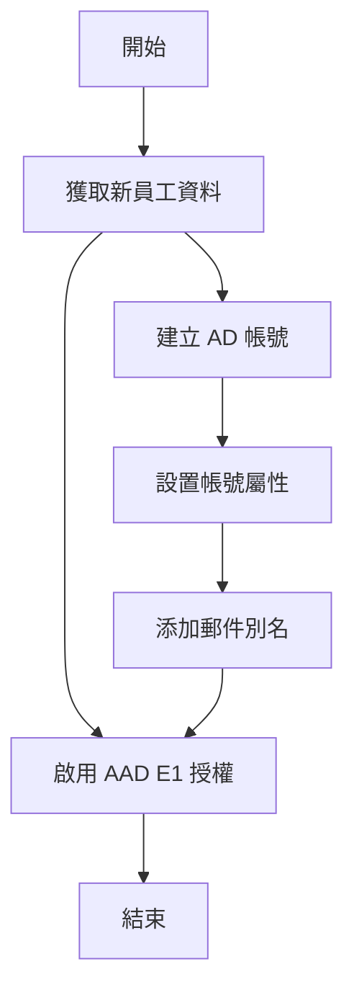
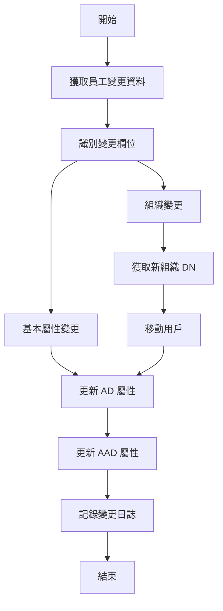
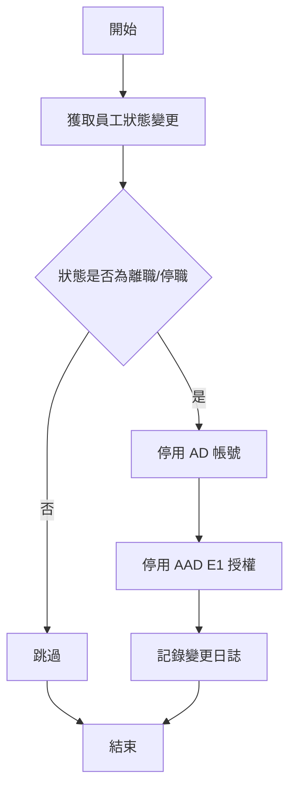
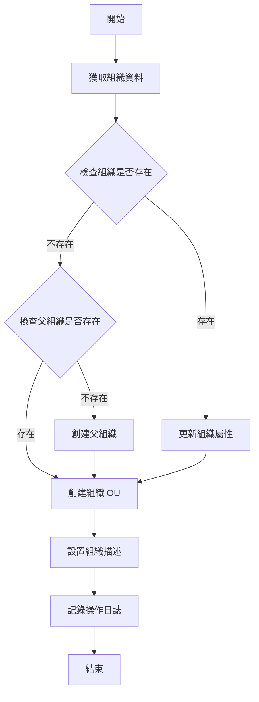
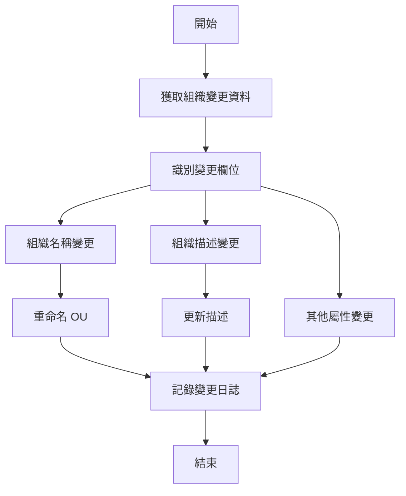
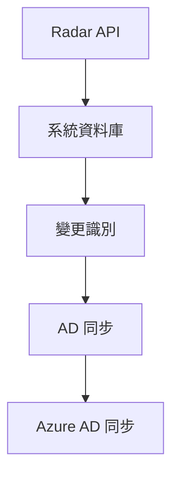
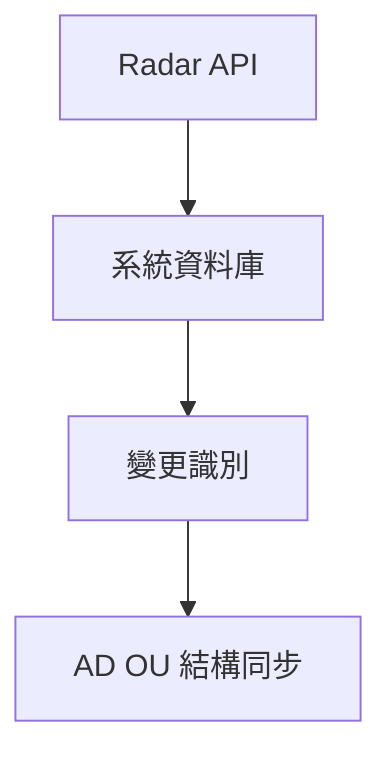
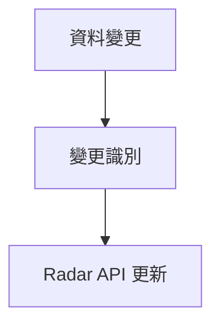

# SOGO AD 中台系統分析需求書

## 1. 緒論

### 1.1 文件目的與範圍

本文件為太平洋崇光百貨股份有限公司（以下簡稱 SOGO）的 Active Directory (AD) 中台系統之系統分析需求書。旨在明確定義系統的功能需求、非功能需求、架構設計及業務流程等，作為系統開發與實現的基礎。

### 1.2 專案背景

隨著 SOGO 企業數位化的深入，員工帳號管理與組織結構同步變得日益重要。為了解決多系統間的帳號管理問題，特別是與 Azure AD 的整合需求，SOGO 決定開發一個專門的 AD 中台系統，作為員工中台系統 (ee-midd) 與 Active Directory 之間的橋樑，實現員工資料的自動同步與統一管理。

### 1.3 術語與縮寫說明

| 術語/縮寫 | 說明                                                       |
| --------- | ---------------------------------------------------------- |
| AD        | Active Directory，微軟的目錄服務                           |
| LDAP      | Lightweight Directory Access Protocol，輕量目錄存取協定    |
| AAD       | Azure Active Directory，微軟雲端版目錄服務                 |
| OU        | Organizational Unit，組織單位，AD 中的組織結構單元         |
| DN        | Distinguished Name，LDAP 中用於唯一識別記錄的路徑          |
| UAC       | User Account Control，用戶帳號控制，控制 AD 帳號狀態的屬性 |
| ee-midd   | 員工中台系統，SOGO 內部的員工管理系統                      |

## 2. 系統概述

### 2.1 系統目標與範疇

本系統作為 SOGO AD 中台服務平台，主要目標為：

1. 提供統一的 AD 帳戶管理介面
2. 自動化 AD 帳戶生命週期管理
3. 與員工中台（ee-midd）整合，同步員工資料
4. 維護 AD 組織結構（OU）
5. 確保 AD 資料的安全性與一致性

### 2.2 系統架構

#### 2.2.1 技術架構

1. 後端框架與函式庫

   - Spring Boot 2.7.18
   - Spring Security
   - Spring Data LDAP
   - Spring Data JPA
   - Spring Data JDBC
   - JWT (jsonwebtoken) 0.9.1
   - Lombok
   - Apache HttpClient 4.5.14
2. 資料庫

   - PostgreSQL 16.8
   - JPA/Hibernate ORM
   - Hibernate Validator
3. API 文件

   - Springdoc OpenAPI UI 1.6.9
4. 開發工具

   - Java 8
   - Maven 3.10.1
   - Spring Boot DevTools
5. 監控與管理

   - Spring Boot Actuator
   - 自定義監控指標

#### 2.2.2 系統架構圖



#### 2.2.3 系統層次

1. 表現層（Controller 層）

   - ADSyncController：處理 AD 同步相關 API
   - RadarDataController：處理雷達圖資料 API
2. 業務邏輯層（Service 層）

   - AD 同步服務：
     * ADLDAPSyncService：LDAP 同步服務
     * AzureADService：Azure AD 操作服務
   - 資料服務：
     * APIEmployeeInfoService：員工資料服務
     * APIOrganizationService：組織資料服務
3. 資料存取層（Entity 層）

   - APIEmployeeInfo：員工資料實體
   - APIOrganization：組織資料實體
   - APIEmployeeInfoActionLog：員工操作日誌
   - APIOrganizationActionLog：組織操作日誌
4. 配置層（Configuration）

   - LdapConfig：LDAP 連線配置
   - RestTemplateConfig：REST 客戶端配置
   - SwaggerConfig：API 文件配置

### 2.3 使用者角色與權限

1. AD 管理員

   - 具備完整 AD 管理權限
   - 可執行帳戶管理操作
   - 可管理組織結構
2. 系統管理員

   - 具備系統配置權限
   - 可查看系統監控資訊
   - 可執行同步作業
3. HR 管理人員

   - 通過員工中台間接使用本系統功能
   - 主要關注員工帳號的生命週期管理
4. IT 支援人員

   - 負責處理 AD/Azure AD 相關問題
   - 使用系統提供的工具進行問題診斷和修復

## 3. 功能規格

### 3.1 核心功能模組

#### 3.1.1 AD 帳戶管理

1. LDAP 帳戶同步

   - 帳戶建立流程

     * 接收員工資料（ADEmployeeSyncDto）
     * 建構員工 DN（Distinguished Name）
     * 使用 PowerShell 建立 AD 帳戶
     * 設定帳戶基本屬性（displayName, mail 等）
   - 帳戶更新流程

     * 檢查更新欄位（updatedFields）
     * 處理組織變更（移動帳戶位置）
     * 處理在職狀態變更
     * 更新 AD 屬性
   - 帳戶停用流程

     * 接收停用請求
     * 設定帳戶停用標記
     * 更新帳戶狀態
2. Azure AD 帳戶管理

   - E1 帳戶啟用流程

     * 根據員工編號或日期查詢待處理記錄
     * 取得 Azure AD 存取令牌
     * 設定使用者地區（TW）
     * 分配 E1 授權
     * 重設使用者密碼
     * 同步資料至 Radar 系統
   - E1 帳戶停用流程

     * 查詢待停用帳戶
     * 取得 Azure AD 使用者 ID
     * 移除 E1 授權
     * 更新帳戶狀態
   - E1 帳戶刪除流程

     * 批次處理所有帳戶
     * 逐一刪除 Azure AD 帳戶
     * 記錄處理結果

#### 3.1.2 組織結構管理

1. 組織同步流程

   - 組織建立

     * 建構組織 DN
     * 確保上層 OU 結構存在
     * 建立組織單位（OU）
     * 設定組織屬性
   - 組織更新

     * 檢查組織變更
     * 更新組織屬性
     * 處理組織移動
   - 組織停用

     * 檢查是否有子組織
     * 處理組織成員
     * 標記組織狀態
2. 組織結構維護

   - 層級關係管理
     * 維護組織層級（orgLevel）
     * 更新組織路徑（orgPath）
     * 處理上下級關係

#### 3.1.3 資料同步管理

1. 同步策略

   - 增量同步

     * 根據 last_sync_time 判斷
     * 只同步變更資料
     * 記錄同步狀態
   - 全量同步

     * 定期執行（每日）
     * 確保資料一致性
     * 處理異常資料
2. 錯誤處理

   - 同步失敗處理

     * 記錄錯誤資訊
     * 重試機制
     * 通知管理員
   - 資料不一致處理

     * 檢測不一致
     * 自動修正
     * 記錄修正歷史
3. 監控與日誌

   - 同步狀態監控

     * 追蹤同步進度
     * 記錄處理時間
     * 統計成功/失敗數
   - 操作日誌記錄

     * 記錄所有變更
     * 保存變更前後資料
     * 支援資料回溯

#### 3.1.4 Radar 資料整合

1. 員工資料同步

   - 從 Radar API 獲取員工基本資訊
   - 存儲至本地資料庫
   - 標記需要同步至 AD 的資料
2. 組織資料同步

   - 從 Radar API 獲取組織結構資訊
   - 存儲至本地資料庫
   - 處理組織層級關係
3. 資料反向同步

   - 將 AD 中的電子郵件地址更新回 Radar 系統
   - 處理分機號碼等基本資訊的反向同步

### 3.2 API 服務規格

#### 3.2.1 AD 同步 API

1. 處理 AD 員工資料

```
端點：POST /process-ad-employee-data
用途：處理並同步員工資料至 AD
請求參數：
{
    "base-date": "yyyy-MM-dd"  // 基準日期：日期之後的資料
}
回應格式：
{
    "message": "同步成功完成"
}
```

2. 啟用 E1 帳戶

```
端點：POST /employees/enable-e1Account
用途：啟用員工的 E1 帳戶
請求參數：
{
    "employee-no": "string",  // 員工編號（可選）
    "base-date": "yyyy-MM-dd"  // 基準日期
}
回應格式：
{
    "message": "啟用員工 AAD E1 帳號授權成功"
}
```

3. 停用 E1 帳戶

```
端點：POST /employees/disable-e1Account
用途：停用員工的 E1 帳戶
請求參數：
{
    "employee-no": "string",  // 員工編號（可選）
    "base-date": "yyyy-MM-dd"  // 基準日期
}
回應格式：
{
    "message": "停用員工 AAD E1 帳號授權成功"
}
```

4. 處理 AD 組織資料

```
端點：POST /process-ad-organization-data
用途：處理並同步組織資料至 AD
請求參數：
{
    "base-date": "yyyy-MM-dd"  // 基準日期：日期之後的資料
}
回應格式：
{
    "message": "組織同步成功完成"
}
```

#### 3.2.2 Radar 資料 API

1. 系統初始化

```
端點：POST /system/initialization
用途：初始化系統資料
回應格式：
{
    "message": "資料庫初始化成功"
}
```

2. 同步員工資訊

```
端點：POST /api/sync/employee-info
用途：同步員工資訊
請求參數：
{
    "employee-no": "string",  // 員工編號（可選）
    "base-date": "yyyy-MM-dd"  // 基準日期（可選）
}
回應格式：
{
    "message": "員工資訊同步成功"
}
```

3. 同步組織資訊

```
端點：POST /api/sync/organization-info
用途：同步組織資訊
請求參數：
{
    "org-code": "string",  // 組織代碼（可選）
    "base-date": "yyyy-MM-dd"  // 基準日期（可選）
}
回應格式：
{
    "message": "組織資訊同步成功"
}
```

4. 更新員工郵件地址與分機號碼

```
端點：POST /api/ZZApi/ZZUpdateEmpEMailExtNo
用途：更新員工的郵件地址與分機號碼，並同步到 Radar 系統
請求參數：
{
    "employee-no": "string"  // 員工編號
}
回應格式：
{
    "message": "更新員工郵件地址與分機號碼成功"
}
```

### 3.3 業務流程

#### 3.3.1 帳戶同步流程



#### 3.3.2 員工帳號生命週期管理流程

1. 新員工帳號創建流程



2. 員工資訊更新流程



3. 員工帳號停用流程



#### 3.3.3 組織結構管理流程

1. 組織創建流程



2. 組織更新流程



## 4. 資料架構

### 4.1 資料庫設計

#### 4.1.1 員工資料相關表

1. 員工資訊表 (api_employee_info)

```sql
CREATE TABLE api_employee_info (
    id BIGSERIAL PRIMARY KEY,                    -- 主鍵
    employee_no VARCHAR(10) NOT NULL,            -- 員工編號，唯一識別
    account_name VARCHAR(50),                    -- AD 帳戶名稱
    display_name VARCHAR(100),                   -- 顯示名稱
    email VARCHAR(100),                          -- 電子郵件
    department VARCHAR(100),                     -- 部門
    position VARCHAR(50),                        -- 職位
    status VARCHAR(10),                          -- 狀態（ACTIVE/INACTIVE）
    sync_status VARCHAR(20),                     -- 同步狀態
    last_sync_time TIMESTAMP,                    -- 最後同步時間
    created_at TIMESTAMP DEFAULT CURRENT_TIMESTAMP,  -- 創建時間
    updated_at TIMESTAMP DEFAULT CURRENT_TIMESTAMP,  -- 更新時間
    created_by VARCHAR(50),                      -- 創建者
    updated_by VARCHAR(50),                      -- 更新者
    CONSTRAINT uk_employee_no UNIQUE (employee_no)
);

-- 用途說明：
-- 1. 儲存員工基本資訊
-- 2. 追蹤 AD 帳戶同步狀態
-- 3. 維護資料變更歷史
```

2. 員工操作日誌表 (api_employee_info_action_log)

```sql
CREATE TABLE api_employee_info_action_log (
    id BIGSERIAL PRIMARY KEY,                    -- 主鍵
    employee_no VARCHAR(10) NOT NULL,            -- 員工編號
    action_type VARCHAR(20) NOT NULL,            -- 操作類型（CREATE/UPDATE/DELETE）
    action_time TIMESTAMP NOT NULL,              -- 操作時間
    action_by VARCHAR(50) NOT NULL,              -- 操作者
    old_value JSONB,                             -- 變更前資料
    new_value JSONB,                             -- 變更後資料
    remarks TEXT,                                -- 備註
    created_at TIMESTAMP DEFAULT CURRENT_TIMESTAMP  -- 記錄創建時間
);

-- 用途說明：
-- 1. 記錄所有員工資料的變更歷史
-- 2. 提供稽核追蹤功能
-- 3. 支援資料回溯需求
```

#### 4.1.2 組織資料相關表

1. 組織資訊表 (api_organization)

```sql
CREATE TABLE api_organization (
    id BIGSERIAL PRIMARY KEY,                    -- 主鍵
    org_id VARCHAR(20) NOT NULL,                 -- 組織編號
    org_name VARCHAR(100) NOT NULL,              -- 組織名稱
    parent_id VARCHAR(20),                       -- 上級組織編號
    org_path TEXT,                               -- 組織路徑
    status VARCHAR(10),                          -- 狀態（ACTIVE/INACTIVE）
    sync_status VARCHAR(20),                     -- 同步狀態
    last_sync_time TIMESTAMP,                    -- 最後同步時間
    created_at TIMESTAMP DEFAULT CURRENT_TIMESTAMP,  -- 創建時間
    updated_at TIMESTAMP DEFAULT CURRENT_TIMESTAMP,  -- 更新時間
    created_by VARCHAR(50),                      -- 創建者
    updated_by VARCHAR(50),                      -- 更新者
    CONSTRAINT uk_org_id UNIQUE (org_id)
);

-- 用途說明：
-- 1. 儲存組織結構資訊
-- 2. 維護組織層級關係
-- 3. 追蹤組織同步狀態
```

2. 組織操作日誌表 (api_organization_action_log)

```sql
CREATE TABLE api_organization_action_log (
    id BIGSERIAL PRIMARY KEY,                    -- 主鍵
    org_id VARCHAR(20) NOT NULL,                 -- 組織編號
    action_type VARCHAR(20) NOT NULL,            -- 操作類型（CREATE/UPDATE/DELETE）
    action_time TIMESTAMP NOT NULL,              -- 操作時間
    action_by VARCHAR(50) NOT NULL,              -- 操作者
    old_value JSONB,                             -- 變更前資料
    new_value JSONB,                             -- 變更後資料
    remarks TEXT,                                -- 備註
    created_at TIMESTAMP DEFAULT CURRENT_TIMESTAMP  -- 記錄創建時間
);

-- 用途說明：
-- 1. 記錄組織資料變更歷史
-- 2. 提供組織變更稽核追蹤
-- 3. 支援組織結構回溯
```

3. 組織關係表 (api_organization_relation)

```sql
CREATE TABLE api_organization_relation (
    id BIGSERIAL PRIMARY KEY,                    -- 主鍵
    org_id VARCHAR(20) NOT NULL,                 -- 組織編號
    parent_id VARCHAR(20) NOT NULL,              -- 父組織編號
    org_level INTEGER,                           -- 組織層級
    created_at TIMESTAMP DEFAULT CURRENT_TIMESTAMP,  -- 創建時間
    updated_at TIMESTAMP DEFAULT CURRENT_TIMESTAMP,  -- 更新時間
    CONSTRAINT uk_org_parent UNIQUE (org_id, parent_id)
);

-- 用途說明：
-- 1. 維護組織之間的層級關係
-- 2. 支援組織樹狀結構查詢
-- 3. 優化組織關係變更操作
```

#### 4.1.3 資料關聯說明

1. 員工與組織關聯

- 員工資料表通過 department 欄位關聯到組織資料
- 組織結構通過 parent_id 建立層級關係
- 使用 org_path 欄位優化組織樹查詢

2. 操作日誌關聯

- 員工操作日誌通過 employee_no 關聯員工資料
- 組織操作日誌通過 org_id 關聯組織資料
- 使用 JSONB 類型儲存變更歷史，支援彈性查詢

3. 同步狀態追蹤

- sync_status 欄位追蹤同步狀態
- last_sync_time 記錄最後同步時間
- 支援增量同步機制

### 4.2 資料流程

#### 4.2.1 員工資料同步流程



#### 4.2.2 組織資料同步流程



#### 4.2.3 反向同步流程



## 5. 系統整合

### 5.1 與 ee-midd 整合

1. API 調用

   - 使用 RestTemplate 進行 API 調用
   - JWT 認證機制
   - 錯誤重試機制
2. 資料同步策略

   - 增量同步為主
   - 每日全量同步為輔
   - 錯誤重試機制

### 5.2 與 Azure AD 整合

1. Azure AD 連線

   - 使用 Azure AD SDK
   - 實作連線池管理
   - 錯誤處理機制
2. 同步機制

   - 即時同步
   - 批次處理
   - 錯誤重試

### 5.3 LDAP 整合

1. LDAP 連線配置

   - 使用 Spring LDAP
   - 連線池管理
   - SSL/TLS 加密
2. 操作安全性

   - 加密連線
   - 最小權限原則
   - 操作日誌記錄

### 5.4 Radar API 整合

1. API 調用機制

   - 使用 RestTemplate 發送 HTTP 請求
   - 使用 API Token 進行認證
   - 處理 REST 響應與錯誤
2. 資料同步處理

   - 解析 JSON 數據
   - 資料轉換與映射
   - 批次處理大量數據

### 5.5 系統介面

1. **Active Directory 介面**

   - 協議：LDAP/LDAPS
   - 端口：389/636
   - 用途：用戶和組織結構管理
2. **Azure Active Directory 介面**

   - 協議：REST API（Microsoft Graph API）
   - 認證：OAuth 2.0
   - 用途：雲端帳戶和授權管理
3. **PostgreSQL 資料庫介面**

   - 連接：JDBC
   - 版本：PostgreSQL 14+
   - 用途：數據持久化
4. **員工中台系統 (ee-midd) 介面**

   - 協議：REST API
   - 認證：Bearer Token
   - 用途：接收員工和組織資料變更
5. **Radar API 介面**

   - 協議：REST API
   - 認證：API Token
   - 用途：獲取和同步員工/組織資料

## 6. 非功能性需求

### 6.1 效能需求

1. 響應時間

   - API 響應時間 < 1 秒
   - 批次同步處理 < 30 分鐘
2. 並發處理

   - 使用連線池
   - 資源使用限制
3. 處理能力

   - 系統應能處理每日至少 1000 筆員工資料同步請求
   - 批量同步處理速度應達到每分鐘 100 筆記錄
   - 系統應支持並發請求，同時處理多個同步任務

### 6.2 安全性需求

1. 認證與授權

   - JWT 認證
   - SSL/TLS 加密
2. 資料安全

   - 敏感資料加密
   - 操作日誌記錄
3. 存取控制

   - API 訪問應實施 IP 白名單限制
   - 所有敏感操作需要適當的授權
   - 系統操作應生成審計日誌，便於追蹤

### 6.3 可用性需求

1. 系統可用性

   - 系統運作時間 > 99.9%
   - 自動故障恢復
2. 監控機制

   - 使用 Spring Boot Actuator
   - 自定義健康檢查
   - 系統指標監控

### 6.4 可靠性需求

1. 資料一致性

   - 資料同步過程應保證一致性，避免部分同步成功部分失敗
   - 系統應能處理各種異常情況，包括網絡中斷、服務不可用等
   - 系統應具備交易完整性，確保關鍵操作的原子性
2. 錯誤處理

   - 系統應具備自動重試機制，處理臨時性連接失敗
   - 系統應提供可靠的錯誤處理和回退機制
   - 關鍵操作失敗應有明確的錯誤提示和日誌記錄

### 6.5 可維護性需求

1. 代碼標準

   - 系統代碼應遵循統一的命名規範和編碼標準
   - 關鍵操作應有詳細的日誌記錄，便於問題診斷
   - 系統應提供清晰的錯誤信息，方便故障排查
2. 配置管理

   - 配置參數應支持環境變量注入，便於不同環境部署
   - 敏感配置應有安全存儲機制
   - 配置變更應有審計記錄

### 6.6 可擴展性需求

1. 架構擴展
   - 系統架構應支持功能模塊的擴展
   - 應支持水平擴展，增加實例應對高負載
   - 資料模型設計應考慮未來擴展需要

## 7. 部署與維運

### 7.1 部署環境

1. 應用程式設定

```properties
SERVER_PORT=8081
SPRING_PROFILES_ACTIVE=prod
APP_NAME=ad-midd
```

2. 資料庫配置

```properties
SPRING_DATASOURCE_URL=jdbc:postgresql://localhost:5434/ad_midd
SPRING_DATASOURCE_USERNAME=postgres
SPRING_DATASOURCE_PASSWORD=your_password
```

3. AD 設定

```properties
AD_LDAP_URL=ldaps://your.ad.server:636
AD_LDAP_BASE=dc=sogo,dc=com,dc=tw
AD_LDAP_USERNAME=cn=admin,dc=sogo,dc=com,dc=tw
AD_LDAP_PASSWORD=your_ldap_password
```

4. Azure AD 設定

```properties
AZURE_AD_TENANT_ID=your_tenant_id
AZURE_AD_CLIENT_ID=your_client_id
AZURE_AD_CLIENT_SECRET=your_client_secret
```

5. Radar API 設定

```properties
RADAR_API_SERVER_URI=https://api.radar.sogo.com.tw
RADAR_API_TOKEN=your_radar_token
```

### 7.2 監控與維護

1. 監控項目

   - 系統健康狀態
   - API 響應時間
   - 資料同步狀態
   - 資源使用狀況
2. 日誌管理

   - 應用程式日誌
   - 操作日誌
   - 錯誤日誌
3. 效能指標

   - CPU 使用率
   - 記憶體使用率
   - API 呼叫統計
   - 同步作業執行時間

### 7.3 部署策略

1. 部署方式

   - Docker 容器化部署
   - CI/CD 管道自動化部署
2. 環境配置

   - 使用環境變量配置不同環境參數
   - 配置文件外部化
3. 版本控制

   - Git 分支管理
     - `main`：生產環境
     - `develop`：開發集成分支
     - `feature/*`：功能開發分支
     - `hotfix/*`：緊急修復分支

## 8. 系統限制與假設

### 8.1 系統限制

1. **網絡連接限制**

   - 系統需要穩定的網絡連接以訪問 Active Directory、Azure AD 和 Radar API
   - 連接中斷可能導致同步失敗
2. **安全限制**

   - AD 操作需要具有足夠權限的 AD 管理員帳號
   - Azure AD 操作需要正確配置的應用程序註冊和權限
3. **技術限制**

   - 組織結構深度不應超過 AD 支持的最大層級
   - API 請求頻率受 Radar API 和 Azure AD API 限制影響
4. **業務限制**

   - 系統主要支持正常的員工和組織生命週期，特殊情況可能需要人工干預
   - 大規模組織重組可能需要特殊處理

### 8.2 前提條件與假設

1. **存在的系統**

   - 假設 Active Directory 服務器已正確配置
   - 假設 Azure AD 租戶已設置並可供訪問
   - 假設員工中台系統可正常工作
2. **數據質量**

   - 假設從 Radar API 獲取的數據格式一致且符合預期
   - 假設員工編號和組織代碼是唯一且穩定的標識符
3. **操作權限**

   - 假設系統運行時具有足夠的 AD 和 Azure AD 操作權限
   - 假設系統具有足夠的數據庫訪問權限
4. **網絡環境**

   - 假設系統部署環境具有穩定的網絡連接
   - 假設系統可以訪問所需的外部系統和 API

## 9. 附錄

### 附錄 A：環境變量配置

| 變量名                     | 說明                  | 示例值                                     |
| -------------------------- | --------------------- | ------------------------------------------ |
| SERVER_PORT                | 服務器端口            | 8081                                       |
| SPRING_PROFILES_ACTIVE     | 激活的配置文件        | prod                                       |
| SPRING_DATASOURCE_URL      | 數據庫連接 URL        | jdbc:postgresql://localhost:5434/ad_midd   |
| SPRING_DATASOURCE_USERNAME | 數據庫用戶名          | postgres                                   |
| SPRING_DATASOURCE_PASSWORD | 數據庫密碼            | your_password                              |
| LDAP_URL                   | LDAP 服務器 URL       | ldaps://your.ad.server:636                 |
| LDAP_BASE_DN               | LDAP 基礎 DN          | dc=sogo,dc=com,dc=tw                       |
| LDAP_USERNAME              | LDAP 用戶名           | cn=admin,dc=sogo,dc=com,dc=tw              |
| LDAP_PASSWORD              | LDAP 密碼             | your_ldap_password                         |
| AZURE_AD_TENANT_ID         | Azure AD 租戶 ID      | your_tenant_id                             |
| AZURE_AD_CLIENT_ID         | Azure AD 客戶端 ID    | your_client_id                             |
| AZURE_AD_CLIENT_SECRET     | Azure AD 客戶端密鑰   | your_client_secret                         |
| JWT_SECRET                 | JWT 密鑰              | your_jwt_secret                            |
| JWT_EXPIRATION             | JWT 過期時間（秒）    | 86400                                      |
| RADAR_API_SERVER_URI       | Radar API 服務器 URI  | https://api.radar.sogo.com.tw              |
| RADAR_API_TOKEN            | Radar API 訪問令牌    | your_radar_token                           |
| AD_SYNC_BASE_URL           | 員工中台 API 基礎 URL | http://employee-center.sogo.com.tw/ee-midd |
| AD_SYNC_TOKEN              | 員工中台 API 訪問令牌 | Bearer your_token                          |
