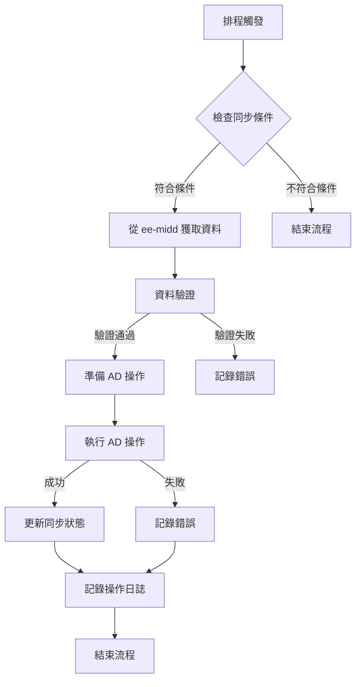

# SOGO AD 中台系統分析需求書

## 1. 系統概述

### 1.1 系統目標與範疇

本系統作為 SOGO AD 中台服務平台，主要目標為：

1. 提供統一的 AD 帳戶管理介面
2. 自動化 AD 帳戶生命週期管理
3. 與員工中台（ee-midd）整合，同步員工資料
4. 維護 AD 組織結構（OU）
5. 確保 AD 資料的安全性與一致性

### 1.2 系統架構

#### 1.2.1 技術架構

1. 後端框架與函式庫

   - Spring Boot 2.7.18
   - Spring Security
   - Spring Data LDAP
   - Spring Data JPA
   - Spring Data JDBC
   - JWT (jsonwebtoken) 0.9.1
   - Lombok
   - Apache HttpClient 4.5.14
2. 資料庫

   - PostgreSQL 42.7.4
   - JPA/Hibernate ORM
   - Hibernate Validator
3. API 文件

   - Springdoc OpenAPI UI 1.6.9
4. 開發工具

   - Java 8
   - Maven 3.10.1
   - Spring Boot DevTools
5. 監控與管理

   - Spring Boot Actuator
   - 自定義監控指標

#### 1.2.2 系統層次

1. 表現層（Controller 層）

   - ADSyncController：處理 AD 同步相關 API
   - RadarDataController：處理雷達圖資料 API
2. 業務邏輯層（Service 層）

   - AD 同步服務：
     * ADLDAPSyncService：LDAP 同步服務
     * AzureADService：Azure AD 操作服務
   - 資料服務：
     * APIEmployeeInfoService：員工資料服務
     * APIOrganizationService：組織資料服務
3. 資料存取層（Entity 層）

   - APIEmployeeInfo：員工資料實體
   - APIOrganization：組織資料實體
   - APIEmployeeInfoActionLog：員工操作日誌
   - APIOrganizationActionLog：組織操作日誌
4. 配置層（Configuration）

   - LdapConfig：LDAP 連線配置
   - RestTemplateConfig：REST 客戶端配置
   - SwaggerConfig：API 文件配置

### 1.3 使用者角色與權限

1. AD 管理員

   - 具備完整 AD 管理權限
   - 可執行帳戶管理操作
   - 可管理組織結構
2. 系統管理員

   - 具備系統配置權限
   - 可查看系統監控資訊
   - 可執行同步作業

## 2. 功能規格

### 2.1 核心功能模組

#### 2.1.1 AD 帳戶管理

1. LDAP 帳戶同步

   - 帳戶建立流程

     * 接收員工資料（ADEmployeeSyncDto）
     * 建構員工 DN（Distinguished Name）
     * 使用 PowerShell 建立 AD 帳戶
     * 設定帳戶基本屬性（displayName, mail 等）
   - 帳戶更新流程

     * 檢查更新欄位（updatedFields）
     * 處理組織變更（移動帳戶位置）
     * 處理在職狀態變更
     * 更新 AD 屬性
   - 帳戶停用流程

     * 接收停用請求
     * 設定帳戶停用標記
     * 更新帳戶狀態
2. Azure AD 帳戶管理

   - E1 帳戶啟用流程

     * 根據員工編號或日期查詢待處理記錄
     * 取得 Azure AD 存取令牌
     * 設定使用者地區（TW）
     * 分配 E1 授權
     * 重設使用者密碼
     * 同步資料至 Radar 系統
   - E1 帳戶停用流程

     * 查詢待停用帳戶
     * 取得 Azure AD 使用者 ID
     * 移除 E1 授權
     * 更新帳戶狀態
   - E1 帳戶刪除流程

     * 批次處理所有帳戶
     * 逐一刪除 Azure AD 帳戶
     * 記錄處理結果

#### 2.1.2 組織結構管理

1. 組織同步流程

   - 組織建立

     * 建構組織 DN
     * 確保上層 OU 結構存在
     * 建立組織單位（OU）
     * 設定組織屬性
   - 組織更新

     * 檢查組織變更
     * 更新組織屬性
     * 處理組織移動
   - 組織停用

     * 檢查是否有子組織
     * 處理組織成員
     * 標記組織狀態
2. 組織結構維護

   - 層級關係管理
     * 維護組織層級（orgLevel）
     * 更新組織路徑（orgPath）
     * 處理上下級關係

#### 2.1.3 資料同步管理

1. 同步策略

   - 增量同步

     * 根據 last_sync_time 判斷
     * 只同步變更資料
     * 記錄同步狀態
   - 全量同步

     * 定期執行（每日）
     * 確保資料一致性
     * 處理異常資料
2. 錯誤處理

   - 同步失敗處理

     * 記錄錯誤資訊
     * 重試機制
     * 通知管理員
   - 資料不一致處理

     * 檢測不一致
     * 自動修正
     * 記錄修正歷史
3. 監控與日誌

   - 同步狀態監控

     * 追蹤同步進度
     * 記錄處理時間
     * 統計成功/失敗數
   - 操作日誌記錄

     * 記錄所有變更
     * 保存變更前後資料
     * 支援資料回溯

### 2.2 API 服務規格

#### 2.2.1 AD 同步 API

1. 處理 AD 員工資料

```
端點：POST /process-ad-employee-data
用途：處理並同步員工資料至 AD
請求參數：
{
    "employeeData": {
        "employeeNo": "string",
        "name": "string",
        "email": "string",
        "department": "string",
        "position": "string"
    }
}
回應格式：
{
    "code": "200",
    "message": "success",
    "data": {
        "processedCount": number,
        "successCount": number,
        "failCount": number,
        "details": []
    }
}
```

2. 啟用 E1 帳戶

```
端點：POST /employees/enable-e1Account
用途：啟用員工的 E1 帳戶
請求參數：
{
    "employeeNo": "string"
}
回應格式：
{
    "code": "200",
    "message": "success",
    "data": {
        "status": "ENABLED",
        "employeeNo": "string"
    }
}
```

3. 停用 E1 帳戶

```
端點：POST /employees/disable-e1Account
用途：停用員工的 E1 帳戶
請求參數：
{
    "employeeNo": "string"
}
回應格式：
{
    "code": "200",
    "message": "success",
    "data": {
        "status": "DISABLED",
        "employeeNo": "string"
    }
}
```

4. 處理 AD 組織資料

```
端點：POST /process-ad-organization-data
用途：處理並同步組織資料至 AD
請求參數：
{
    "organizationData": {
        "orgId": "string",
        "name": "string",
        "parentId": "string",
        "path": "string"
    }
}
回應格式：
{
    "code": "200",
    "message": "success",
    "data": {
        "processedCount": number,
        "successCount": number,
        "failCount": number,
        "details": []
    }
}
```

#### 2.2.2 Radar 資料 API

1. 系統初始化

```
端點：POST /system/initialization
用途：初始化系統資料
回應格式：
{
    "code": "200",
    "message": "success",
    "data": {
        "status": "INITIALIZED"
    }
}
```

2. 同步員工資訊

```
端點：POST /api/sync/employee-info
用途：同步員工資訊
請求參數：
{
    "syncDate": "string",
    "forceSync": boolean
}
```

3. 同步組織資訊

```
端點：POST /api/sync/organization-info
用途：同步組織資訊
請求參數：
{
    "syncDate": "string",
    "forceSync": boolean
}
```

### 2.3 業務流程

#### 2.3.1 帳戶同步流程



## 3. 資料架構

### 3.1 資料庫設計

#### 3.1.1 員工資料相關表

1. 員工資訊表 (api_employee_info)

```sql
CREATE TABLE api_employee_info (
    id BIGSERIAL PRIMARY KEY,                    -- 主鍵
    employee_no VARCHAR(10) NOT NULL,            -- 員工編號，唯一識別
    account_name VARCHAR(50),                    -- AD 帳戶名稱
    display_name VARCHAR(100),                   -- 顯示名稱
    email VARCHAR(100),                          -- 電子郵件
    department VARCHAR(100),                     -- 部門
    position VARCHAR(50),                        -- 職位
    status VARCHAR(10),                          -- 狀態（ACTIVE/INACTIVE）
    sync_status VARCHAR(20),                     -- 同步狀態
    last_sync_time TIMESTAMP,                    -- 最後同步時間
    created_at TIMESTAMP DEFAULT CURRENT_TIMESTAMP,  -- 創建時間
    updated_at TIMESTAMP DEFAULT CURRENT_TIMESTAMP,  -- 更新時間
    created_by VARCHAR(50),                      -- 創建者
    updated_by VARCHAR(50),                      -- 更新者
    CONSTRAINT uk_employee_no UNIQUE (employee_no)
);

-- 用途說明：
-- 1. 儲存員工基本資訊
-- 2. 追蹤 AD 帳戶同步狀態
-- 3. 維護資料變更歷史
```

2. 員工操作日誌表 (api_employee_info_action_log)

```sql
CREATE TABLE api_employee_info_action_log (
    id BIGSERIAL PRIMARY KEY,                    -- 主鍵
    employee_no VARCHAR(10) NOT NULL,            -- 員工編號
    action_type VARCHAR(20) NOT NULL,            -- 操作類型（CREATE/UPDATE/DELETE）
    action_time TIMESTAMP NOT NULL,              -- 操作時間
    action_by VARCHAR(50) NOT NULL,              -- 操作者
    old_value JSONB,                             -- 變更前資料
    new_value JSONB,                             -- 變更後資料
    remarks TEXT,                                -- 備註
    created_at TIMESTAMP DEFAULT CURRENT_TIMESTAMP  -- 記錄創建時間
);

-- 用途說明：
-- 1. 記錄所有員工資料的變更歷史
-- 2. 提供稽核追蹤功能
-- 3. 支援資料回溯需求
```

#### 3.1.2 組織資料相關表

1. 組織資訊表 (api_organization)

```sql
CREATE TABLE api_organization (
    id BIGSERIAL PRIMARY KEY,                    -- 主鍵
    org_id VARCHAR(20) NOT NULL,                 -- 組織編號
    org_name VARCHAR(100) NOT NULL,              -- 組織名稱
    parent_id VARCHAR(20),                       -- 上級組織編號
    org_path TEXT,                               -- 組織路徑
    status VARCHAR(10),                          -- 狀態（ACTIVE/INACTIVE）
    sync_status VARCHAR(20),                     -- 同步狀態
    last_sync_time TIMESTAMP,                    -- 最後同步時間
    created_at TIMESTAMP DEFAULT CURRENT_TIMESTAMP,  -- 創建時間
    updated_at TIMESTAMP DEFAULT CURRENT_TIMESTAMP,  -- 更新時間
    created_by VARCHAR(50),                      -- 創建者
    updated_by VARCHAR(50),                      -- 更新者
    CONSTRAINT uk_org_id UNIQUE (org_id)
);

-- 用途說明：
-- 1. 儲存組織結構資訊
-- 2. 維護組織層級關係
-- 3. 追蹤組織同步狀態
```

2. 組織操作日誌表 (api_organization_action_log)

```sql
CREATE TABLE api_organization_action_log (
    id BIGSERIAL PRIMARY KEY,                    -- 主鍵
    org_id VARCHAR(20) NOT NULL,                 -- 組織編號
    action_type VARCHAR(20) NOT NULL,            -- 操作類型（CREATE/UPDATE/DELETE）
    action_time TIMESTAMP NOT NULL,              -- 操作時間
    action_by VARCHAR(50) NOT NULL,              -- 操作者
    old_value JSONB,                             -- 變更前資料
    new_value JSONB,                             -- 變更後資料
    remarks TEXT,                                -- 備註
    created_at TIMESTAMP DEFAULT CURRENT_TIMESTAMP  -- 記錄創建時間
);

-- 用途說明：
-- 1. 記錄組織資料變更歷史
-- 2. 提供組織變更稽核追蹤
-- 3. 支援組織結構回溯
```

#### 3.1.3 資料關聯說明

1. 員工與組織關聯

- 員工資料表通過 department 欄位關聯到組織資料
- 組織結構通過 parent_id 建立層級關係
- 使用 org_path 欄位優化組織樹查詢

2. 操作日誌關聯

- 員工操作日誌通過 employee_no 關聯員工資料
- 組織操作日誌通過 org_id 關聯組織資料
- 使用 JSONB 類型儲存變更歷史，支援彈性查詢

3. 同步狀態追蹤

- sync_status 欄位追蹤同步狀態
- last_sync_time 記錄最後同步時間
- 支援增量同步機制

## 4. 系統整合

### 4.1 與 ee-midd 整合

1. API 調用

   - 使用 RestTemplate 進行 API 調用
   - JWT 認證機制
   - 錯誤重試機制
2. 資料同步策略

   - 增量同步為主
   - 每日全量同步為輔
   - 錯誤重試機制

### 4.2 與 Azure AD 整合

1. Azure AD 連線

   - 使用 Azure AD SDK
   - 實作連線池管理
   - 錯誤處理機制
2. 同步機制

   - 即時同步
   - 批次處理
   - 錯誤重試

### 4.3 LDAP 整合

1. LDAP 連線配置

   - 使用 Spring LDAP
   - 連線池管理
   - SSL/TLS 加密
2. 操作安全性

   - 加密連線
   - 最小權限原則
   - 操作日誌記錄

## 5. 非功能性需求

### 5.1 效能需求

1. 響應時間

   - API 響應時間 < 1 秒
   - 批次同步處理 < 30 分鐘
2. 並發處理

   - 使用連線池
   - 資源使用限制

### 5.2 安全性需求

1. 認證與授權

   - JWT 認證
   - SSL/TLS 加密
2. 資料安全

   - 敏感資料加密
   - 操作日誌記錄

### 5.3 可用性需求

1. 系統可用性

   - 系統運作時間 > 99.9%
   - 自動故障恢復
2. 監控機制

   - 使用 Spring Boot Actuator
   - 自定義健康檢查
   - 系統指標監控

## 6. 部署與維運

### 6.1 部署環境

1. 應用程式設定

```properties
SERVER_PORT=8081
SPRING_PROFILES_ACTIVE=prod
APP_NAME=ad-midd
```

2. 資料庫配置

```properties
SPRING_DATASOURCE_URL=jdbc:postgresql://localhost:5434/ad_midd
SPRING_DATASOURCE_USERNAME=postgres
SPRING_DATASOURCE_PASSWORD=your_password
```

3. AD 設定

```properties
AD_LDAP_URL=ldaps://your.ad.server:636
AD_LDAP_BASE=dc=sogo,dc=com,dc=tw
AD_LDAP_USERNAME=cn=admin,dc=sogo,dc=com,dc=tw
AD_LDAP_PASSWORD=your_ldap_password
```

### 6.2 監控與維護

1. 監控項目

   - 系統健康狀態
   - API 響應時間
   - 資料同步狀態
   - 資源使用狀況
2. 日誌管理

   - 應用程式日誌
   - 操作日誌
   - 錯誤日誌
